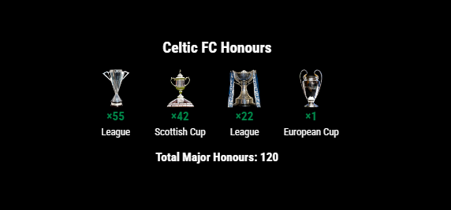

# MMM-MyTeams-Honours

A simple MagicMirror² module that displays the major honours of a highlighted team with data scraped from a team specific wikipedia website. Default team is Celtic FC.

## Features

- Displays major trophies won by a team
- Shows the count of each trophy type
- Shows total honours count
- Customizable trophy images .
- Configurable display options


## Screenshots



## Installation

1. Navigate to your MagicMirror's modules folder:
```bash
cd ~/MagicMirror/modules/
```

2. Clone this repository:
```bash
git clone https://github.com/gitgitaway/MMM-MyTeams-Honours.git
```

3. Install dependencies:
```bash
cd MMM-MyTeams-Honours
npm install
```

4. Add the module to your `config/config.js` file:
```javascript
{
    module: "MMM-MyTeams-Honours",
    position: "top_right", // Or any other position
    config: {
        team: "Celtic FC", // Change for your team
        scrapeUrl: "https://en.wikipedia.org/wiki/Celtic_F.C.#Honours", // Change for your team's URL
        showTotal: true,
        trophySize: 80,
        trophySpacing: 10,
        showLabels: true,
        labelSize: "small",
        showCount: true,
        countSize: "medium",
      
    }
}
```

## Configuration Options

| Option | Description | Default |
| ------ | ----------- | ------- |
| `team` | The name of the team to display | `"Celtic FC"` |
| `scrapeUrl` | URL to scrape for honours data | `"https://en.wikipedia.org/wiki/Celtic_F.C.#Honours"` |
| `updateInterval` | How often to update the data (in ms) | `24 * 60 * 60 * 1000` (once per day) |
| `retryDelay` | Delay before retrying after a failed update (in ms) | `5000` (5 seconds) |
| `maxRetries` | Maximum number of retries after failure | `5` |
| `showTotal` | Whether to show the total honours count | `true` |
| `animationSpeed` | Speed of fade animations (in ms) | `1000` |
| `trophySize` | Size of trophy images (in pixels) | `80` |
| `trophySpacing` | Spacing between trophies (in pixels) | `10` |
| `showLabels` | Whether to show trophy labels | `true` |
| `labelSize` | Size of labels (`"small"`, `"medium"`, `"large"`) | `"small"` |
| `showCount` | Whether to show the count for each trophy | `true` |
| `countSize` | Size of count (`"small"`, `"medium"`, `"large"`) | `"medium"` |
| `countColor` | Color of the count text | `"#FFD700"` (gold) |
| `labelColor` | Color of the label text | `"#FFFFFF"` (white) |
| `debug` | Enable debug logging | `false` |

## Trophy Images

Trophy images should be placed in the `trophyImages` folder. The default mapping is:

```javascript
trophyMapping: {
    "Scottish League/Premier League/Premiership": "league.png",
    "Scottish Cup": "scottish-cup.png",
    "Scottish League Cup": "league-cup.png",
    "European Cup/Champions League": "european-cup.png",
    "Other": "trophy.png"
}
```
## Notes
-This module uses the (https://en.wikipedia.org/wiki/Celtic_F.C.#Honours) as its source for Celtic`s  honours data. If the page structure changes or if there are issues with scraping, the module may not work correctly.
- If you want to add your teams trophy count you need to replace the scrapperURL with one which contains the relevant major trophy details for your team.
-If you want to add more trophy types, simply create an image file and add it to the `trophyImages` folder. Then, modify the `trophyMapping` object accordingly.

## Troubleshooting
- If no data appears check the web site URL you are using is correct
- If no trophys appear check that you have the correct image in the trophyImages folder.
- If the module shows your team have more trophys than they have actually won then you are probably a NewCo supporter 🤭   
- If you still have problems ensure that the debug option is set to true and check the console log for errors,

## License

MIT
