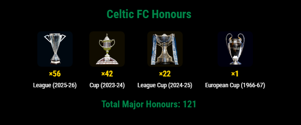
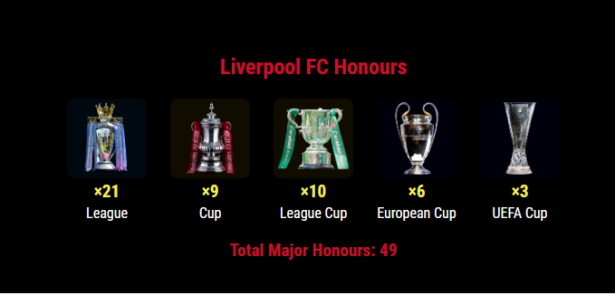

# MMM-MyTeams-Honours

A universal MagicMirror² module that displays the major honours of any football club worldwide. It features high-accuracy Wikipedia scraping, multi-team rotation, and high accessibility.

## Screenshots




## Features

- **Universal Support**: Works for any club with a Wikipedia honours section (Premier League, La Liga, Bundesliga, etc.).
- **High-Accuracy Scraper**: Intelligent filtering of runners-up, finalists, and non-winning records to ensure only actual honours are displayed.
- **Canonical Mapping**: Automatically maps club-specific trophies to universal categories (National League, European Cup, etc.) for consistent display.
- **Smart Caching**: Persistent file-based cache with ETag/Last-Modified support.
- **Asterisk Indicators**: Automatically detects shared trophies or predecessor club history (liquidation) to show an asterisk on trophy counts.
- **Season Ranges**: Displays accurate season strings (e.g., "2023-24") for the most recent wins.
- **Accessible Design**: ARIA regions, semantic HTML, and screen-reader optimized counts.
- **Multi-Language**: 8 European languages including Irish and Scottish Gaelic.

## Installation

```bash
cd ~/MagicMirror/modules/
git clone https://github.com/gitgitaway/MMM-MyTeams-Honours.git
cd MMM-MyTeams-Honours
npm install
```

## Quick Start - Minimal config

Add the module to your `config/config.js` file:

```javascript
{
    module: "MMM-MyTeams-Honours",
    position: "top_right",
    config: {
        team: "Liverpool FC",
        scrapeUrl: "https://en.wikipedia.org/wiki/Liverpool_F.C.#Honours",
        accentColor: "#C8102E",
        debug: false
    }
}
```
## Full config version

```javascript
{
    module: "MMM-MyTeams-Honours",
    position: "top_right",
    config: {
        updateInterval: 24 * 60 * 60 * 1000,
        rotationInterval: 20 * 1000,
        retryDelay: 5000,
        team: "Celtic FC",
        scrapeUrl: "https://en.wikipedia.org/wiki/Celtic_F.C.#Honours",
        teams: [],
        maxRetries: 5,
        showTotal: true,
        animationSpeed: 1000,
        trophySize: 64,
        trophySpacing: 8,
        showLabels: true,
        showLastWon: false,
        labelSize: "small",
        showCount: true,
        countSize: "medium",
        countColor: "#FFD700",
        labelColor: "#FFFFFF",
        trophyMapping: {
            "National League":     "scottish-league.png",
            "National Cup":        "scottish-cup.png",
            "National League Cup": "league-cup.png",
            "European Cup":        "european-cup.png",
            "UEFA Cup":            "uefa-cup.png",
            "Other":               "trophy.png"
        },
        debug: false,
        accentColor: "#018749",
        useWikidata: false,
        indicatePredecessor: false,
        cacheTTL: 5 * 60 * 1000,
        darkMode: null,
        fontColorOverride: null,
        opacityOverride: null
    }
}
```

## Configuration Options

| Option | Default | Description |
| :--- | :--- | :--- |
| `updateInterval` | `86400000` | Update frequency in milliseconds (default: 24 hours). |
| `rotationInterval` | `20000` | Interval for rotating between multiple teams in milliseconds (default: 20 seconds). |
| `retryDelay` | `5000` | Delay before retrying a failed request in milliseconds. |
| `team` | `"Celtic FC"` | Default team name to display. |
| `scrapeUrl` | `"https://en.wikipedia.org/wiki/Celtic_F.C.#Honours"` | Wikipedia URL to scrape for honours data. |
| `teams` | `[]` | Optional array of `{ team, scrapeUrl, accentColor }` objects for multi-team rotation. |
| `maxRetries` | `5` | Maximum number of retries for failed requests. |
| `showTotal` | `true` | Show total major honours count. |
| `animationSpeed` | `1000` | Fade animation speed in milliseconds. |
| `trophySize` | `64` | Size of trophy images in pixels. |
| `trophySpacing` | `8` | Spacing between trophies in pixels. |
| `showLabels` | `true` | Show trophy labels (e.g., "National League"). |
| `showLastWon` | `false` | Show the year of the most recent win (requires Wikidata or parsed text). |
| `labelSize` | `"small"` | Text size of trophy labels (`small`, `medium`, `large`). |
| `showCount` | `true` | Show the count for each trophy type. |
| `countSize` | `"medium"` | Text size of trophy counts (`small`, `medium`, `large`). |
| `countColor` | `"#FFD700"` | Color of the trophy count text. |
| `labelColor` | `"#FFFFFF"` | Color of the trophy label text. |
| `trophyMapping` | See source | Object mapping canonical trophy types to image filenames. |
| `debug` | `false` | Enable console logging for troubleshooting. |
| `accentColor` | `"#018749"` | Default accent color for the module (e.g., club primary color). |
| `useWikidata` | `false` | (Prototype) Use Wikidata SPARQL API instead of Wikipedia scraping. |
| `indicatePredecessor` | `false` | Show an asterisk (*) on counts if honours include a predecessor club's history. |
| `cacheTTL` | `300000` | Cache time-to-live for scraped data (default: 5 minutes). |
| `darkMode` | `null` | Force theme: `null` (auto), `true` (dark), `false` (light). |
| `fontColorOverride` | `null` | Global font color override (e.g., `"#FFFFFF"`). |
| `opacityOverride` | `null` | Element opacity override (0.0 to 1.0). |


## Documentation

Comprehensive guides are available in the [./documentation](./documentation) folder:

### 🛠 Configuration & Setup
- **[Configuration Examples](./documentation/Configuration_Examples.md)**: Templates for single/multiple teams and custom mappings.
- **[How This Module Works](./documentation/HowThisModuleWorks.md)**: Architecture, caching, and request management.

### 🎨 Customization
- **[Trophy Mapping Guide](./documentation/mapYourTeamsTrophys-Guide.md)**: How to add and map custom trophy images for your specific club.
- **[Theming Guide](./documentation/Theming_Guide.md)**: Using CSS Custom Properties and accent colors.
- **[Translations Guide](./documentation/Translations_Guide.md)**: Adding support for new languages.

### ♿ Standards & Support
- **[Accessibility Features](./documentation/Accessability_Features.md)**: ARIA labels, roles, and contrast requirements.
- **[Troubleshooting](./documentation/Troubleshooting.md)**: Common issues and fixes.
- **[Debug Guide](./documentation/Debug_Guide.md)**: Enabling logs and using the request manager.


## Support

- For security vulnerabilities, refer to [SECURITY.md](./SECURITY.md).
- For version history, refer to [CHANGELOG.md](./CHANGELOG.md).

## License

MIT
